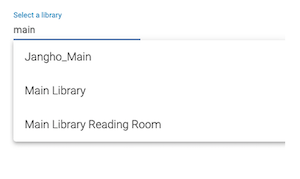

# Auto-Complete

A reusable component for Ex Libris Cloud Apps which provides lazy and eagerly loaded auto-complete functionality. Wraps the mat-autocomplete component. Features include:
* Lazy loading for large lists
* Automatic retrieval of options from Alma APIs, including pagination
* Cache eagerly-loaded data

## Configuration
After installing the component, add the following to _app.module.ts_:

```typescript
import { AutoCompleteModule } from 'eca-components';

...

@NgModule({
  imports: [
  ...
    AutoCompleteModule,
  ],
```

## Usage

### Eager Loading
In eager-loading mode, the component fetches all the data when loaded. If the ID attribute is provided, the data is cached as long as the app is loaded.



There are two methods for eager loading: built-in and custom. The built-in method uses the Alma APIs and standard paging mechanism to retrieve all the options. The custom method allows you to handle the API calls and provide the data to the component.

To use the **built-in** method, simply provide the URL of the relevant Alma API:
```html
<eca-auto-complete
  [data]='{ request: "/conf/libraries" }'
  id='libraries'
></eca-auto-complete>
```

By default, the `name` property is used as the display and the entire entity is used as the value. You can customize each:

```ts
getProxies: GetAllOptionsSettings = {
  request: '/conf/integration-profiles?type=PROXY_DEFINITION',
  name: i => i.code.concat(i.description ? ` (${i.description})` : ''),
  value: i => i.code
}
```
```html
<eca-auto-complete
  [data]="getProxies"
  id="proxies"
></eca-auto-complete>
```

The **custom** method allows you to control the API calls and pass the result to the component for display. This supports use cases where you wish to limit the results of the raw API. To use custom loading, provide a function which returns an Observable array of options. In this example, we're retrieving libraries and limiting by campus:
```ts
getLibraries = campus: Observable<Option[]> => {
  return this.restService.call('/conf/libraries')
  .pipe(
    map(results => (results.library || []).filter(l => !!l.campus && l.campus.value==campus)),
    map(results => results.map(l => ({ value: l.code, name: l.name })))
  )
}
```
```html
<eca-auto-complete
  [data]="getLibraries('MAIN')"
></eca-auto-complete>
```

You can also provide hard-coded data as an Observable array of options:
```ts
import { Option } from 'eca-components';

getData(): Observable<Option[]> {
  return of([
    { name: 'One option', value: 'one' },
    { name: 'Twpo options', value: 'two' },
    { name: 'Three options', value: 'three' },
    { name: 'Four options', value: 'four' },
  ])
}
```
```html
<eca-auto-complete
  [data]="getData"
  label="Select some data"
></eca-auto-complete>
```

### Lazy loading
Lazy loading executes a query when the user adds input in the search field. 


For example, to search for a set:
```ts
searchSets = (name: string = null, type: string = 'ITEM'): Observable<Option[]> => {
  let params = { 'content_type': type }
  if (name) params['q'] = `name~${name}`;
  return this.restService.call( {
    url: '/conf/sets',
    queryParams: params
  })
  .pipe(
    map(results => results.set || []),
    map(results => results.map(r => ({ value: r, name: r.name })))
  )  
}
```
```html
<eca-auto-complete
  [lazy]="searchSets"
>
</eca-auto-complete>
```

Or to search users:
```ts
searchUsers = (q: string): Observable<Option[]> => {
  return this.restService.call(`/users?limit=20&q=ALL~${q.replace(/ /g,'%2b')}`)
  .pipe(
    map(results => results.user || []),
    map(results => results.map(u => ({ value: u.primary_id, name: u.first_name + ' ' + u.last_name })))
  )
}
```

### All properties

```html
<eca-auto-complete
  id="sets"
  [lazy]="searchSets"
  [data]="getData"
  [control]="control"
  (onOptionSelected)="selected($event)"
  label="Autocomplete.SelectSet"
  placeHolder="Type to search..."
>
</eca-auto-complete>
```

**`id: string`**
Recommended as it allows the data to be cached.

**`lazy: (val: string) => Observable<Array<Option>>`**
A function which searches a data source and return an array of options. Alternative to `data`.

**`data: (() => Observable<Array<Option>>) | GetAllOptionsSettings`**
A function which return an array of options, or [`GetAllOptionsSettings`](#GetAllOptionsSettings) to use the built-in loading. Alternative to `lazy`.

**`control: FormControl`**
A form control which is updated with the value. Can be used in Reactive Forms.

**`onOptionSelected: EventEmitter`**
Event when a value is selected

```html
<eca-auto-complete
  [lazy]="searchSets"
  (onOptionSelected)="selected($event)"
>
</eca-auto-complete>
```
```ts
selected(val) {
  console.log('optionSelected', val);
}
```

**`label: string`**
A string of text or translation key to be used as the field label. Default "Select one"

**`placeHolder: string`**
A string of text or translation key to be used as the field place holder. Default "Type to search..."


#### GetAllOptionsSettings
**`request: Request | string`**
URL for the API or a full [`CloudAppRestService Request`](https://developers.exlibrisgroup.com/cloudapps/docs/api/rest-service/#Request)

**`name: (obj: any) => string`**
Function which accepts the full entity and returns the name to be used. Default `(obj: any) => obj.name`

**`value: (obj: any) => string`**
Function which accepts the full entity and returns the value to be used. Default `(obj: any) => obj`

### Methods
**`clear()`**
Clears component.

```html
<button mat-stroked-button (click)="users.clear()">Clear</button>
<eca-auto-complete #users
  [lazy]="searchUsers"
  label="Select a user"
>
</eca-auto-complete>
```
