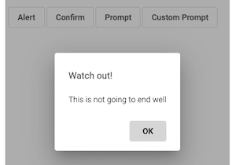
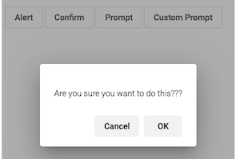
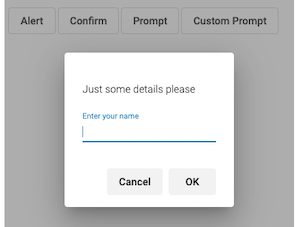
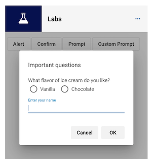

# Dialogs

A reusable component for Ex Libris Cloud Apps to present dialogs according to the [Style Guide](https://developers.exlibrisgroup.com/cloudapps/docs/style/). Wraps the mat-dialog component. Features include:
* Alert, confirm, prompt which replace the built-in JavaScript features
* Custom prompts


## Configuration
After installing the component, add the following to _app.module.ts_:

```typescript
import { DialogModule } from 'eca-components';

...

@NgModule({
  imports: [
  ...
    DialogModule,
  ],
```

## Usage
The component includes a `DialogService` which supports three methods- `alert`, `confirm`, and `prompt`. Each method returns an Observable with the result of the dialog. The text supports translation- pass the translation key from your application if desired.

Inject the service into your component's constructor:
```typescript
  constructor(
    private dialog: DialogService,
  ) { }
```

### Alert
```typescript
/* Simple */
this.dialog.alert('Watch out!')
.subscribe();

/* Full */
this.dialog.alert({ title: 'Watch out!', text: 'Dialog.Alert', ok: 'Okey-dokey' })
.subscribe();
```



### Confirm
```typescript
/* Simple */
this.dialog.confirm('Dialog.Confirm')
.subscribe(result => console.log(result));

/* Full */
this.dialog.confirm({ text: 'Dialog.Confirm', , ok: 'Okey-dokey', cancel: 'No way Jose' })
.subscribe(result => {
  if (!result) {
    this.result = 'nope';
  } else {
    this.result = 'okey-dokey';
  }
});
```



### Prompt
```typescript
/* Simple */
this.dialog.prompt('Dialog.Prompt')
.subscribe(result => console.log(result));

this.dialog.prompt({ text: 'Dialog.Prompt', prompt: 'Dialog.PromptField' })
.subscribe(result => {
  if (!result) return;
  this.result = `Hello there ${result}`;
});
```



#### Custom Prompt
To use a custom prompt, create the prompt component, such as _custom-dialog.component.ts_:

```typescript
import { Inject } from "@angular/core";
import { Component } from "@angular/core";
import { MatDialogRef, MAT_DIALOG_DATA } from '@angular/material/dialog';
import { TranslateService } from "@ngx-translate/core";
import { PromptDialog, PromptDialogData } from "eca-components";

export interface CustomDialogResult {
  name: string;
  icecream: string;
}
@Component({
  selector: 'app-custom-dialog',
  template: `<h2 mat-dialog-title translate>{{data.title}}</h2>
  <mat-dialog-content>
    <p *ngIf="text">{{text}}</p>
    <div>
      <label>{{'Dialog.Custom.IceCream' | translate }}</label>
      <mat-radio-group [(ngModel)]="result.icecream">
        <mat-radio-button value="vanilla">Vanilla</mat-radio-button>
        <mat-radio-button value="chocolate">Chocolate</mat-radio-button>
      </mat-radio-group>
    </div>
    <mat-form-field>
      <mat-label>{{data.prompt | translate}}</mat-label>
      <input matInput #input [(ngModel)]="result.name" 
        (keyup.enter)="dialogRef.close(result)" 
      >
    </mat-form-field>
  </mat-dialog-content>
  <mat-dialog-actions align="end">
    <button mat-flat-button color="secondary" mat-dialog-close>{{'Cancel' | translate}}</button>
    <button mat-flat-button color="secondary" [mat-dialog-close]="result" cdkFocusInitial>{{'OK' | translate}}</button>
  </mat-dialog-actions>`,
  styles: [
    '.mat-form-field { display: block; }'
  ]
})
export class CustomDialog extends PromptDialog {
  result: CustomDialogResult = { name: "", icecream: ""};

  constructor(
    @Inject(MAT_DIALOG_DATA) public data: PromptDialogData,
    public translate: TranslateService,
    public dialogRef: MatDialogRef<PromptDialog>
  ) {
    super(data,translate,dialogRef);
  }
}
```

Then we can provide the custom dialog component in our call to `prompt`:
```typescript
  this.dialog.prompt(CustomDialog, { title: 'Dialog.Custom.Title', prompt: 'Dialog.PromptField' })
  .subscribe((result: CustomDialogResult) => {
    if (!result) return;
    this.result = `Hello there ${result.name}. 
      I like ${result.icecream} ice cream too.`;
  });
```



Note that the custom dialog must be provided in the entry components in the main module. Alternatively you can create a new module and import that into the main module:

```typescript
import { CommonModule } from "@angular/common";
import { NgModule } from "@angular/core";
import { FormsModule } from "@angular/forms";
import { MaterialModule } from "@exlibris/exl-cloudapp-angular-lib";
import { TranslateModule } from "@ngx-translate/core";
import { DialogModule } from 'eca-components';
import { CustomDialog } from "./dialogs/custom-dialog.component";

@NgModule({
  imports: [
    DialogModule,
    CommonModule,
    MaterialModule,
    FormsModule,
    TranslateModule,
  ],
  declarations: [CustomDialog],
  entryComponents: [CustomDialog],
})
export class AppDialogModule { }
```

### DialogData
The following fields are supported in the `DialogData` passed in to the service methods:

* `title`: Title of the dialog window
* `text`: Text of the dialog window. Pass translation options as second value in array
* `cancel`: Text or translate key for cancel button
* `ok`: Text or translate key for OK button

The `PromptDialogData` has an additional two properties:
* `prompt`: Field name
* `val`: Initial value of field