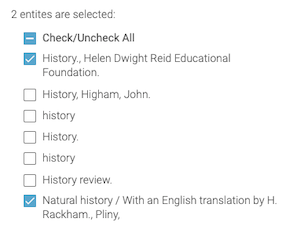
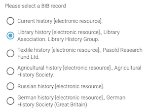

# Select Entities

Reusable components for Ex Libris Cloud Apps to select one or multiple entities visible on the current Alma screen. 

## Configuration
After installing the component, add the following to _app.module.ts_:

```typescript
import { SelectEntitiesModule } from 'eca-components';

...

@NgModule({
  imports: [
  ...
    SelectEntitiesModule,
  ],
```

## Select Entities
The select entities component supports multiple selection. Features include:
* Display description of page entities
* Check/uncheck all
* Selection across multiple pages in Alma



Use the select entities component in your own component as follows.

Add an array to collect selected entities in your _component.ts_:
```typescript
selectedEntities = new Array<Entity>();
```

In your _component.html_ page, add a reference to the component and the array:
```html
  <eca-select-entities
    [(selected)]="selectedEntities"
    >
  </eca-select-entities>
```

## Select Entity
The select entity component supports selecting a single entity. Features include:
* Display description of page entities
* Radio buttons to select a single entity



Use the select entities component in your own component as follows.

Add an array to collect selected entities in your _component.ts_:
```typescript
selectedEntity: Entity = null;
```

In your _component.html_ page, add a reference to the component and the array:
```html
<eca-select-entity
  [(selected)]="selectedEntity"
  >
</eca-select-entity>
```

## Other methods
Both components also support the following properties/methods:

**`clear`**

Clears all selected items:
```typescript
  @ViewChild(SelectEntitiesComponent) selectEntitiesComponent: SelectEntitiesComponent;

  clear() {
    this.selectEntitiesComponent.clear();
  }
```

**`count`**

Emits count of entities. Can be used to change user interface based on whether entities are displayed.
```typescript
entityCount = 0;
```

```html
<p *ngIf="entityCount == 0">Please navigate to a screen with entities.</p>
<eca-select-entities #selectEntities
  [(selected)]="selectedEntities"
  (count)="entityCount=$event"
  >
</eca-select-entities>
```

**`entityTypes`**

Filter the entity types to be displayed:
```html
<eca-select-entities #selectEntities
  [(selected)]="selectedEntities"
  [entityTypes]="['BIB_MMS']"
  >
</eca-select-entities>
```

**`truncate`**

Truncate the entity list to one line each:
```html
<eca-select-entities #selectEntities
  [(selected)]="selectedEntities"
  [truncate]="true"
  >
</eca>
```
From v1.4.1

**`lineNumbers`**

Add line numbers to the entity list:
```html
<eca-select-entities #selectEntities
  [(selected)]="selectedEntities"
  [lineNumbers]="true"
  >
</eca>
```
From v1.4.2

**`entities$`**

Provide an observable of entities which overrides the entities displayed on the Alma screen. 

In this example, we're retrieving all of the displayed and limiting to those created by the current user:

_component.ts_:

```typescript
  entities$ = this.eventsService.entities$.pipe(
    tap(() => this.loading = true),
    mergeMap(entities => 
      combineLatest([
        of(entities),
        this.eventsService.getInitData(),
        forkJoin(entities.map(e => this.restService.call(e.link)))
          .pipe(defaultIfEmpty([]))
      ])
    ),
    map(([entities, initData, full]) => {
      const relevant = full.filter(f => f.created_by.value == initData.user.primaryId).map(f=>f.id);
      return entities.filter(e => relevant.includes(e.id));
    }),
    tap(() => this.loading = false)
  )
```

_component.html_:

```html
<eca-select-entities #selectEntities
  [(selected)]="selectedEntities"
  [entityTypes]="['SET']"
  [entities$]="entities$"
  >
</eca-select-entities>
```
